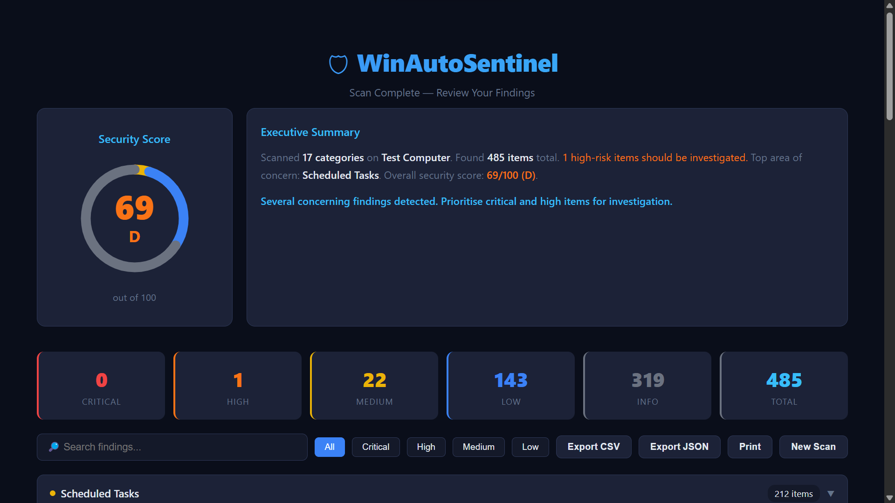
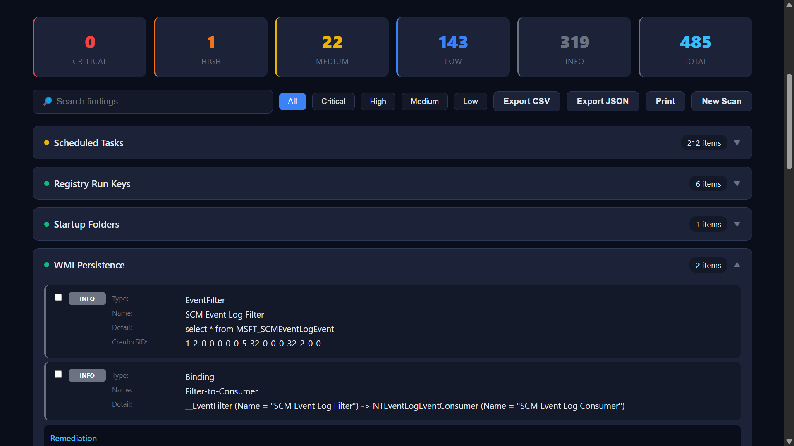
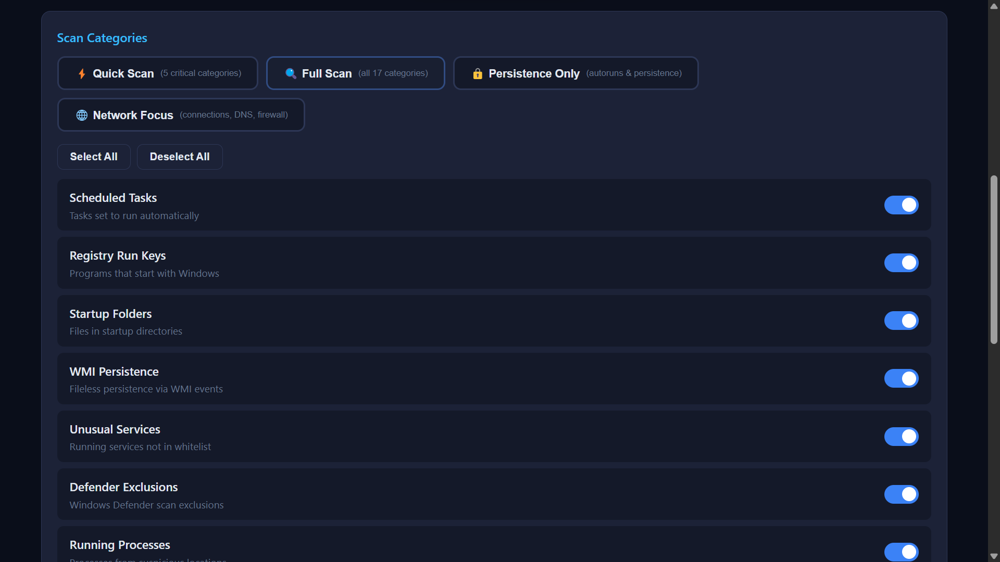
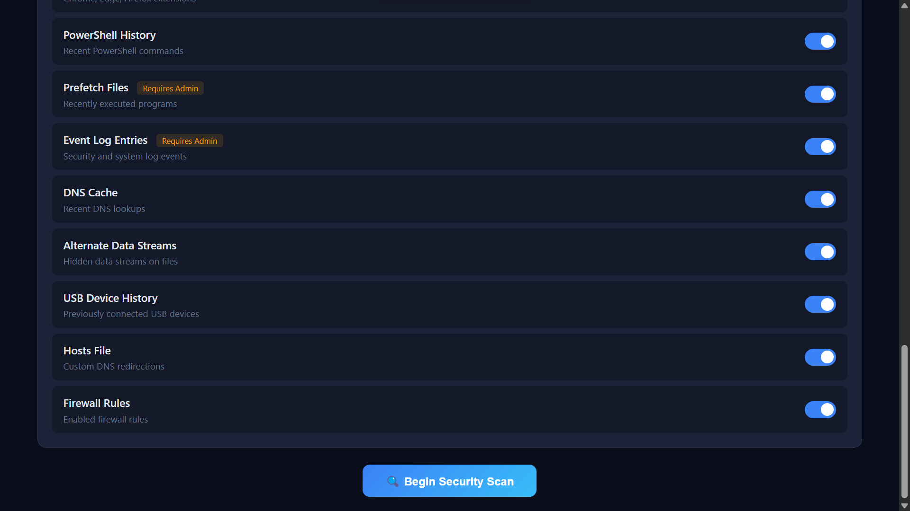
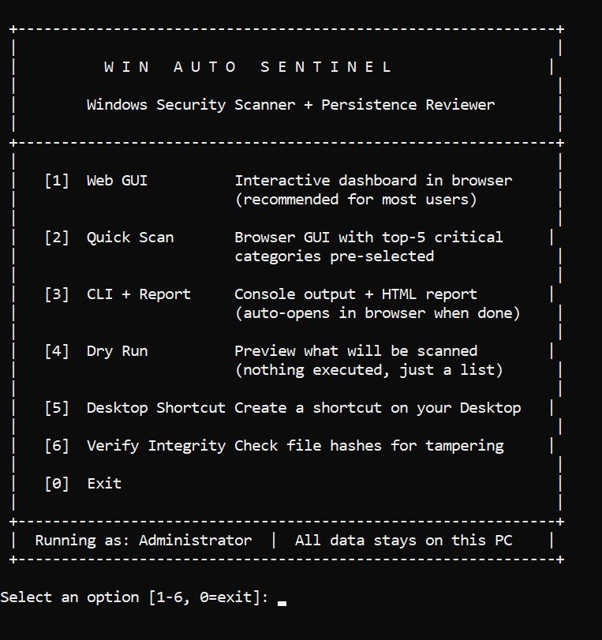

# WinAutoSentinel

<p align="center">
  
</p>

[](LICENSE)
[](https://docs.microsoft.com/en-us/powershell/)
[](https://www.microsoft.com/windows)
[](#trust--transparency)

**A comprehensive, interactive Windows security review tool with a browser-based GUI, real-time scanning, risk scoring, and an interactive dashboard — all in pure PowerShell with zero external dependencies.**

<p align="center">
  
  <br><em>Security health score with risk breakdown</em>
</p>

<p align="center">
  
  <br><em>Interactive security report in the GUI</em>
</p>

<p align="center">
  
  <br><em>Scan categories — choose what to scan</em>
</p>

<p align="center">
  
  <br><em>More scan categories with admin-required badges</em>
</p>

<p align="center">
  
  <br><em>CLI mode — console output with risk summary</em>
</p>

---

## Trust & Transparency

> **This tool is 100% read-only. It does not modify your system, contact any server, or collect any data.**

| Guarantee | Details |
|---|---|
| **No network calls** | Zero use of `Invoke-WebRequest`, `WebClient`, or any HTTP client. Fully offline. |
| **No system changes** | Every scan uses `Get-*` cmdlets only. No registry writes, no service changes, no file modifications. |
| **No data collection** | Nothing leaves your machine. The web GUI runs on `localhost` only. |
| **No compiled binaries** | 100% plain-text PowerShell. Read every line yourself. |
| **No external dependencies** | No npm, pip, NuGet, or CDN. Self-contained. |
| **Dry-run mode** | Run `.\Win_Auto_Sentinel_Main.ps1 -WhatIf` to see exactly what each scan will read — without executing anything. |

For a full security audit with verification commands, see **[SECURITY.md](SECURITY.md)**.

---

## Quick Start

**Option 1 — Double-click** (easiest):
```
run.bat
```
Double-click `run.bat` — it checks prerequisites, requests admin elevation, then gives you a 6-option menu:
1. **Web GUI** — Full interactive browser dashboard
2. **Quick Scan** — GUI with the 5 most critical categories pre-selected
3. **CLI + Report** — Console output + HTML report (auto-opens in browser)
4. **Dry Run** — Preview what will be scanned, nothing executed
5. **Desktop Shortcut** — Create a shortcut on your Desktop
6. **Verify Integrity** — Show SHA256 hashes to check for tampering

**Option 2 — PowerShell**:
```powershell
.\Win_Auto_Sentinel_GUI.ps1              # Web GUI (recommended)
.\Win_Auto_Sentinel_GUI.ps1 -QuickScan   # Web GUI with top-5 pre-selected
.\Win_Auto_Sentinel_Main.ps1             # CLI mode
.\Win_Auto_Sentinel_Main.ps1 -ExportHTML -AutoOpen  # Scan + auto-open report
.\Win_Auto_Sentinel_Main.ps1 -WhatIf     # Dry run — see what will be scanned
.\Win_Auto_Sentinel_Main.ps1 -Log        # Write a timestamped log file alongside the script
```

**New to this?** Read [QUICKSTART.txt](QUICKSTART.txt) — a plain-text, 5-step guide.

---

## Purpose

WinAutoSentinel is a free, portable, offline PowerShell tool that helps you review and understand what's set to auto-run or persist on your Windows machine. It scans 17 categories of security-relevant artefacts, assigns risk levels (0-100 security score), and presents findings through either a web-based GUI or CLI.

**Designed as a companion to traditional antivirus** — WinAutoSentinel focuses on persistence mechanisms, autoruns, and configuration weaknesses that AV tools often overlook.

- **Interactive Web GUI** — Local browser-based dashboard with scan configuration, live progress, charts, and remediation tips
- **Security Health Score** — 0-100 score with letter grade (A+ to F), weighted by finding severity
- **Risk-scored findings** — Critical / High / Medium / Low / Info severity on every item
- **Structured output** — All functions return proper PowerShell objects (filterable, sortable, exportable)
- **Read-only** — No changes made, no forced actions, no automatic removals
- **Privacy-focused** — Fully offline, nothing leaves your machine
- **Signature verification** — Checks Authenticode signatures on binaries where relevant

---

## Scans Performed (17 categories)

| Category | What it checks | Requires Admin |
|---|---|---|
| **Scheduled Tasks** | Active tasks with Authenticode signature verification and TaskPath-based trust | No |
| **Registry Run Keys** | HKLM/HKCU Run, RunOnce + WOW6432Node (32-bit on 64-bit) | No |
| **Startup Folders** | Per-user and all-users startup directories | No |
| **WMI Persistence** | Event filters, consumers (CommandLine + ActiveScript), bindings | No |
| **Unusual Services** | Running auto-start services not whitelisted, unsigned, or in suspicious paths (Authenticode verified) | No |
| **Defender Exclusions** | Path, process, and extension exclusions in Windows Defender | No |
| **Running Processes** | Processes from suspicious locations or with suspicious names | No |
| **Network Connections** | Established/Listening TCP connections mapped to processes | No |
| **Browser Extensions** | Chrome, Edge, and Firefox extensions with permission analysis | No |
| **PowerShell History** | Recent commands with suspicious pattern detection | No |
| **Prefetch Files** | Recently executed programs from Windows Prefetch | **Yes** |
| **Event Log Entries** | Security (logon failures, account changes), System (service installs, errors) | **Yes** |
| **DNS Cache** | Recent DNS resolver cache entries | No |
| **Alternate Data Streams** | Hidden ADS in Desktop, Downloads, Documents, Temp | No |
| **USB Device History** | Previously connected USB storage devices with serial numbers | No |
| **Hosts File** | Non-default entries that may redirect traffic | No |
| **Firewall Rules** | Enabled rules with port, address, and application filters | No |

---

## Usage

### One-Click Launcher (Recommended for first-timers)
```
run.bat
```
Double-click `run.bat` — it auto-checks prerequisites (PowerShell version, required files), requests admin elevation, then presents a menu:
1. **Web GUI** — Interactive browser dashboard (default)
2. **Quick Scan** — GUI with top-5 critical categories pre-selected, auto-starts
3. **CLI Scan** — Console output + HTML report that auto-opens in your browser
4. **Dry Run** — Shows what each scan reads, then exits (nothing executed)
5. **Desktop Shortcut** — Creates a one-click shortcut on your Desktop
6. **Verify Integrity** — Displays SHA256 hashes of all project files

### Web GUI
```powershell
.\Win_Auto_Sentinel_GUI.ps1
```
This opens your browser to a local dashboard where you can:
- See a **welcome/onboarding banner** explaining what the tool does (dismissible, only shows once)
- Choose from **scan presets**: Quick Scan (5 categories), Full Scan (all 17), Persistence Only, Network Focus
- See system information at a glance
- Toggle individual scan categories on/off
- Confirm before scanning starts
- Watch real-time progress per category
- Explore an interactive results dashboard with:
  - Security health score (0-100 with letter grade)
  - SVG donut chart of risk distribution
  - Auto-generated executive summary
  - Search and filter by risk level
  - Expandable category sections with per-finding details
  - Review checkboxes to track your progress
  - Copy-paste remediation commands
  - CSV/JSON export and print-friendly output

```powershell
# Custom port:
.\Win_Auto_Sentinel_GUI.ps1 -Port 9090

# Don't auto-open browser:
.\Win_Auto_Sentinel_GUI.ps1 -NoBrowser
```

### CLI Mode — Basic Console Output
```powershell
.\Win_Auto_Sentinel_Main.ps1
```

### CLI Mode — Generate Interactive HTML Report
```powershell
.\Win_Auto_Sentinel_Main.ps1 -ExportHTML
```

### CLI Mode — Export to CSV or JSON
```powershell
.\Win_Auto_Sentinel_Main.ps1 -ExportCSV
.\Win_Auto_Sentinel_Main.ps1 -ExportJSON
```

### CLI Mode — All Exports at Once
```powershell
.\Win_Auto_Sentinel_Main.ps1 -ExportHTML -ExportCSV -ExportJSON
```

### CLI Mode — Custom Output Directory
```powershell
.\Win_Auto_Sentinel_Main.ps1 -ExportHTML -OutputDir "C:\Reports"
```

### CLI Mode — Enable File Logging
```powershell
.\Win_Auto_Sentinel_Main.ps1 -ExportHTML -Log
```
Creates a timestamped `.log` file (e.g. `WinAutoSentinel_20260225_143012.log`) in the project directory with scan start/end times, category progress, and error details.

### Dry-Run Mode — See What Will Be Scanned
```powershell
.\Win_Auto_Sentinel_Main.ps1 -WhatIf
```
Lists every `Get-*` cmdlet and path each scan will access, then exits without running anything. Use this to verify the tool's behaviour before your first real scan.

### Run Elevated for Full Coverage
```powershell
# Right-click PowerShell → Run as Administrator, then:
.\Win_Auto_Sentinel_GUI.ps1
# or
.\Win_Auto_Sentinel_Main.ps1 -ExportHTML
```

---

## HTML Report Features

The interactive HTML report (CLI mode) includes:
- **Risk dashboard** — Critical/High/Medium/Low/Info counts at a glance
- **Search** — Full-text search across all findings
- **Risk filtering** — Click a severity level to show only those findings
- **Collapsible sections** — Grouped by category, auto-expands for Critical/High
- **Review checkboxes** — Mark items you've reviewed (greys them out)
- **In-browser CSV/JSON export** — Export visible (filtered) findings
- **Dark theme** — Easy on the eyes
- **Fully offline** — No external resources, works without internet

## Web GUI Features

The web-based GUI (`Win_Auto_Sentinel_GUI.ps1`) provides an enhanced experience:
- **3-view flow** — Configuration → Scanning Progress → Interactive Dashboard
- **Scan presets** — Quick Scan, Full Scan, Persistence Only, Network Focus with one click
- **Onboarding banner** — First-time visitors see a guide explaining what the tool does and doesn't do
- **Scan-complete notification** — Audio chime, notification bar, and title bar update when done
- **Scan configuration** — Toggle switches per category, Select All/Deselect All, admin-required badges
- **Confirmation modal** — Review selection and estimated time before scanning
- **Live progress** — Animated progress bar, per-category status indicators, live finding counts
- **Security Health Score** — 0-100 weighted score with A+ to F letter grade
- **SVG donut chart** — Visual risk distribution (pure SVG, no external libraries)
- **Executive summary** — Auto-generated paragraph summarising findings and recommendations
- **Category remediation** — Copy-paste PowerShell commands to fix common issues
- **Keyboard shortcuts** — `/` to search, `Esc` to dismiss
- **Print stylesheet** — Clean print-friendly layout
- **Zero dependencies** — Self-contained PowerShell HTTP server, no npm/Node/Python/internet

---

## Risk Levels

| Level | Meaning | Example |
|---|---|---|
| **Critical** | Very likely malicious or extremely dangerous | WMI CommandLine consumer, Defender exclusion for `powershell.exe` |
| **High** | Strong indicator of compromise or misconfiguration | Unsigned service in Temp folder, hosts file redirecting google.com |
| **Medium** | Warrants investigation | Unsigned task running PowerShell from non-Microsoft path, failed logon events |
| **Low** | Mildly unusual but often benign | RunOnce entry, unsigned startup shortcut |
| **Info** | Informational, no action needed | Normal USB device, DNS cache entry |

---

## Configuration

### Service Whitelist

The file `legitimate_services.txt` defines patterns for known-good services. Services matching these patterns are excluded from the "Unusual Services" scan.

- One pattern per line, supports wildcards (`*`)
- Lines starting with `#` are comments
- Edit to add trusted software or tighten patterns

**Security note:** Broad patterns like `adobe*` reduce false positives but could mask spoofed service names. For stricter filtering, use more specific patterns (e.g., `adobe acrobat*` instead of `adobe*`).

---

## Architecture

```
run.bat                         ← One-click launcher (prereq checks + 6-option menu)
QUICKSTART.txt                  ← Plain-text 5-step quick start guide
Win_Auto_Sentinel_GUI.ps1       ← Web GUI launcher (local HTTP server + REST API)
gui.html                        ← GUI single-page application (HTML/CSS/JS)
Win_Auto_Sentinel_Main.ps1      ← CLI entry point, orchestration, console output, export, -WhatIf mode
Win_Auto_Sentinel_Functions.ps1 ← Shared constants, logging, 17 scan functions, HTML report generator
legitimate_services.txt         ← Service whitelist (editable)
SECURITY.md                     ← Full transparency & security audit document
LICENSE                         ← MIT License
examples/                       ← Reference forensic collection scripts
Tests/                          ← Pester test suite
```

**Design principles:**
- Every scan function returns `[PSCustomObject[]]` with a `Category` and `Risk` property
- `[ordered]@{}` dictionary preserves section order (no random shuffling)
- Shared `$script:` constants (suspicious binaries, directories, keywords, etc.) defined once and reused across all scan functions — no duplication
- Optional file logging via `Enable-WASLog` / `Write-WASLog` (timestamped, append-safe)
- All string operations use `Get-TruncatedString` to prevent `Substring` crashes
- `Get-CimInstance` replaces deprecated `Get-WmiObject`
- `Get-WinEvent` replaces deprecated `Get-EventLog`
- Signature checks use actual `Get-AuthenticodeSignature`, not guesswork
- Scheduled tasks use TaskPath-based trust (Microsoft system paths) + Authenticode binary verification
- Signature results are cached per-binary to avoid redundant crypto operations

**GUI architecture:**
- PowerShell `HttpListener` serves `gui.html` (an external HTML5/CSS3/JS single-page application) on localhost
- GUI markup lives in its own file for proper syntax highlighting, linting, and maintainability
- Background scanning via PowerShell Runspaces with `[hashtable]::Synchronized()` for thread-safe state
- REST API design: `GET /` (SPA), `GET /api/info`, `POST /api/scan`, `GET /api/status`, `POST /api/shutdown`
- JavaScript polls `/api/status` every 600ms for real-time progress updates
- All charts rendered with inline SVG — zero external libraries

---

## Requirements

- PowerShell 5.1+ (ships with Windows 10/11)
- Windows 10 / 11 / Server 2016+
- Administrator elevation recommended (required for Prefetch and some Event Logs)

---

## License

This project is licensed under the [MIT License](LICENSE).

---

## Contributing

Pull requests, feedback, and suggestions are welcome.
